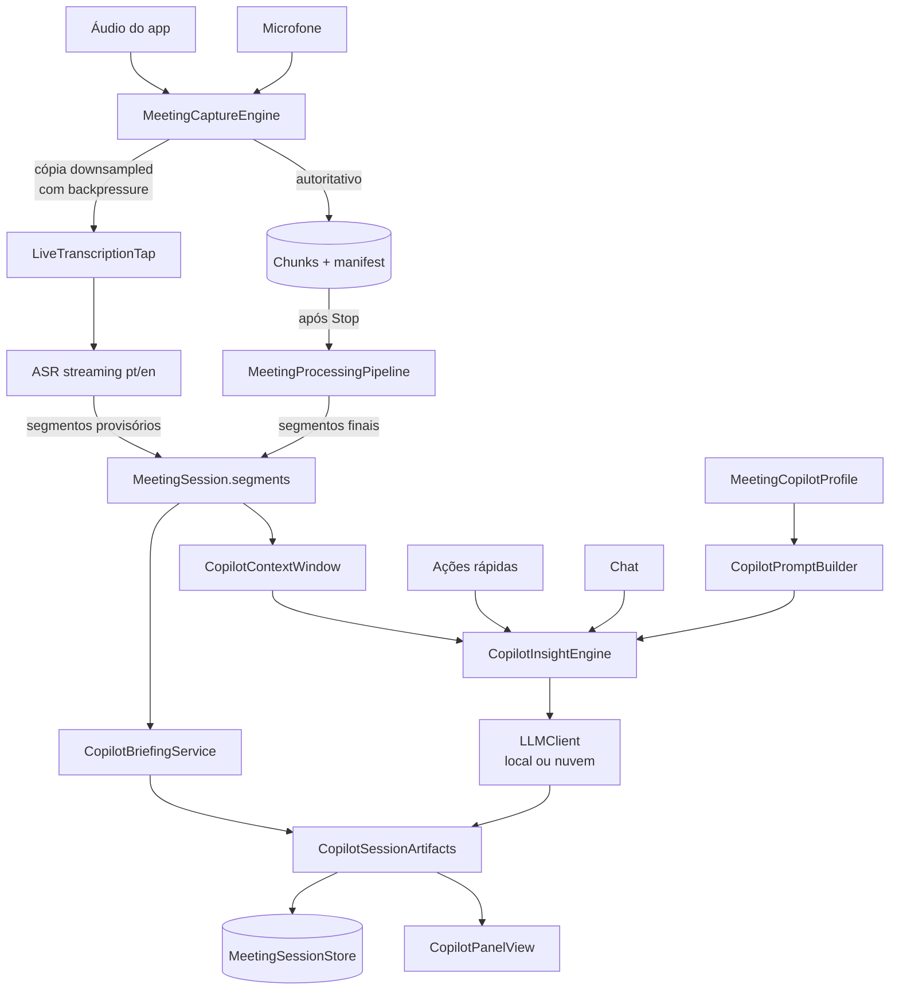

# Implementation Plan: Meeting Copilot

**Branch**: `feature/001-meeting-copilot` | **Date**: 2026-08-06 | **Spec**: [spec.md](./spec.md)
**Input**: `docs/specs/001-feature-meeting-copilot/spec.md`

---

## 1. Sumário

Adicionar uma camada de copiloto sobre a base de Meeting Transcription herdada do `meeting-m1`, sem tocar nos contratos de captura e durabilidade que ela já garante.

A abordagem central é **dois caminhos de transcrição com domínios de falha separados**:

- **Caminho durável (existente, intocado)** — `MeetingCaptureEngine` grava chunks em disco; após o Stop, `MeetingProcessingPipeline` produz a transcrição autoritativa com diarização.
- **Caminho ao vivo (novo)** — um tap sobre os buffers de captura alimenta ASR streaming e produz segmentos **provisórios** que só existem para dar contexto ao copiloto.

A costura para isso já foi deixada pronta pelo PRD upstream: `MeetingTranscriptSegment` já tem `revision`, `status` (provisional/final) e IDs estáveis; `LIVE-001/002/003` preveem exatamente esse modo. Estamos ativando um caminho previsto, não forçando um novo.

Sobre isso, três serviços novos consomem o `LLMClient` existente: motor de insights (automático + ações), chat de sessão e gerador de briefing. Todos gravam num agregado `CopilotSessionArtifacts` persistido junto da sessão.

---

## 2. Contexto técnico

**Linguagem**: Swift 6.3 (toolchain Xcode 26.6), `swift-tools-version: 5.9`
**Plataforma alvo**: macOS 15.0+ (Apple Silicon pleno; Intel com capacidade reduzida)
**UI**: SwiftUI, tema e componentes existentes do FluidVoice (`A11Y-009` — sem chrome one-off)
**Concorrência**: `@MainActor` para coordinators/UI; actors e filas seriais dedicadas para áudio
**Dependências primárias**: `LLMClient` (interno), `FluidAudio` (diarização), `ParakeetRealtimeProvider` / `NemotronProvider` (ASR streaming), `PrivateAIProvider` (LLM local)
**Persistência**: `MeetingSessionStore` (disco, versionado). **Não** usar `UserDefaults` (`CODE-006`, `RISK-004`)
**Testes**: XCTest, com foco em lógica pura; validação real via app instalado (`TEST-REPO-003`)
**Build**: `./build.sh unsigned` neste ambiente (não há identidade de assinatura)
**Metas de performance**: insight ≤5 s pós-turno; ação rápida ≤3 s até primeira palavra; sessão de 60 min com memória limitada
**Restrições**: zero impacto na latência do ditado; falha de IA nunca derruba captura; local-first por padrão

---

## 3. Decisões de arquitetura

### AD-001 — Tap de áudio, não segunda captura

O caminho ao vivo **não** abre um segundo stream. Ele recebe uma cópia downsampled dos buffers que o `MeetingCaptureEngine` já processa, através de um consumidor com backpressure limitada.

*Por quê*: `NONGOAL-008` e `RISK-006` do PRD são explícitos — reusar o caminho de captura do ditado ou abrir captura concorrente entrelaça ciclos de vida e quebra durabilidade. E `LIVE-003` já exige streams limitados com backpressure, onde a falha do vivo não para a gravação.

*Consequência*: se o consumidor ao vivo não acompanha, ele **descarta** buffers e degrada a transcrição provisória. Nunca aplica pressão de volta na escrita em disco.

### AD-002 — Segmentos provisórios são efêmeros por natureza, persistidos por conveniência

Segmentos ao vivo entram no mesmo array `segments` da sessão com `status = .provisional`. O pipeline offline os substitui na reconciliação pós-Stop.

*Por quê*: `LIVE-002` e `LIVE-008` já definem esse contrato. Manter um segundo armazenamento paralelo criaria duas fontes de verdade sobre o mesmo áudio.

*Consequência*: a reconciliação precisa preservar correções manuais feitas durante a reunião (`LIVE-007`). Insights ancoram em **tempo de mídia**, não em ID de segmento, para sobreviver à substituição.

### AD-003 — Perfis de copiloto são um tipo novo, não um `PromptMode` novo

`SettingsStore.PromptMode` (`.dictate` / `.edit`) governa o roteamento de prompt do ditado, incluindo binding por aplicativo. Um caso `.meeting` ali contaminaria esse roteamento.

*Por quê*: `MeetingCopilotProfile` precisa de campos que `DictationPromptProfile` não tem — prompt de briefing, formato de insight (`FR-033`), variantes de idioma (`FR-034`). Reusar o *padrão* do modelo é certo; reusar o *tipo* não.

*Consequência*: código de serialização novo, mas isolamento total do ditado — que é o requisito `FR-030`.

### AD-004 — Um serviço de copiloto por sessão, propriedade do coordinator

`MeetingCopilotService` é criado pelo `MeetingSessionCoordinator` no início da sessão e destruído no fim. Não é singleton em `AppServices`.

*Por quê*: `STATE-007` permite apenas uma sessão ativa. Amarrar o ciclo de vida do copiloto ao da sessão elimina uma classe inteira de bugs de estado órfão.

*Consequência*: a UI observa o serviço através do coordinator, não diretamente.

### AD-005 — Seleção de provedor é por sessão, decidida antes do Start

O provedor (local ou nuvem) é fixado no início da sessão e registrado nos artefatos.

*Por quê*: `FR-026`/`FR-027` exigem consentimento informado. Trocar o destino dos dados no meio de uma reunião significa que parte da fala já foi para um lugar que o usuário talvez não pretendesse.

*Consequência*: trocar de provedor exige encerrar e reiniciar a sessão. É uma restrição deliberada.

---

## 4. Estrutura do código

### 4.1 Documentação da feature

```text
docs/specs/001-feature-meeting-copilot/
├── spec.md          # requisitos (pronto)
├── plan.md          # este arquivo
├── tasks.md         # tarefas ordenadas
└── spec-meta.yaml   # metadados MOSK
```

### 4.2 Código-fonte

```text
Sources/Fluid/
├── Services/
│   ├── Meeting/                          # existente — herdado do meeting-m1
│   │   ├── MeetingCaptureEngine.swift     # [MOD] expor tap de buffers
│   │   ├── MeetingSessionCoordinator.swift# [MOD] modo .live, dono do copiloto
│   │   ├── MeetingModels.swift            # [MOD] transcriptMode na sessão
│   │   ├── MeetingProcessingPipeline.swift# [MOD] reconciliação provisório→final
│   │   ├── MeetingSessionStore.swift      # [MOD] persistir artefatos
│   │   └── Copilot/                       # [NOVO] toda a camada nova
│   │       ├── CopilotModels.swift         # entidades da seção 6 da spec
│   │       ├── MeetingCopilotService.swift # orquestrador por sessão
│   │       ├── CopilotInsightEngine.swift  # gatilho, janela, throttle
│   │       ├── CopilotChatService.swift    # chat da sessão
│   │       ├── CopilotNoteExtractor.swift  # note taker
│   │       ├── CopilotBriefingService.swift# briefing final
│   │       ├── CopilotContextWindow.swift  # janela deslizante + resumo
│   │       ├── CopilotPromptBuilder.swift  # montagem de prompt por perfil/idioma
│   │       └── LiveTranscriptionTap.swift  # ASR streaming provisório
│   └── ...
├── Persistence/
│   ├── MeetingCopilotProfileStore.swift   # [NOVO] perfis + seeds pt/en
│   └── SettingsStore.swift                # [MOD] prefs do copiloto
└── UI/
    ├── MeetingTranscriptionView.swift     # [MOD] hospedar o painel
    └── Meeting/Copilot/                   # [NOVO]
        ├── CopilotPanelView.swift          # container, posição, colapso
        ├── CopilotStreamView.swift         # fluxo cronológico virtualizado
        ├── CopilotInsightCard.swift        # cartão (ver telas de referência)
        ├── CopilotActionBar.swift          # Esclarecer / Recapitular / Pesquisar
        ├── CopilotChatInput.swift          # caixa de texto
        ├── CopilotProfilePicker.swift      # seletor de perfil
        └── CopilotBriefingView.swift       # geração e exibição do briefing

Tests/FluidDictationIntegrationTests/
└── Copilot/                                # [NOVO]
    ├── CopilotContextWindowTests.swift
    ├── CopilotInsightTriggerTests.swift
    ├── CopilotPromptBuilderTests.swift
    ├── CopilotArtifactPersistenceTests.swift
    └── LiveTranscriptReconciliationTests.swift
```

---

## 5. Fluxo de dados



O ponto essencial do diagrama: **a seta para o disco nunca depende da seta para o LLM**. Todo o ramo direito pode falhar inteiro sem afetar o esquerdo.

---

## 6. Fases de implementação

| Fase | Objetivo | Entrega verificável |
| --- | --- | --- |
| **F1 — Fundação** | Modelos, persistência, perfis embarcados | Artefatos persistem e sobrevivem a relaunch |
| **F2 — Transcrição ao vivo** | Tap + ASR streaming + reconciliação | Texto provisório aparece durante a gravação e é substituído após o Stop |
| **F3 — Motor de insights** | Janela, gatilho, prompts, chamadas ao LLM | Cartões de insight guiados pelo perfil (US1) |
| **F4 — Painel** | Container, fluxo, cartão, posição | Painel acima/abaixo com insights renderizados |
| **F5 — Ações e chat** | Três ações + caixa de texto | US2 e US3 completas |
| **F6 — Notas e briefing** | Note taker + geração por perfil | US4 e US5 completas |
| **F7 — Privacidade e robustez** | Opt-in, indicador, auditoria, matriz de falhas | SC-004 a SC-008 verificados |

F1 e F2 são bloqueantes para todo o resto. F4 pode começar em paralelo a F3 com dados simulados.

---

## 7. Riscos e mitigações

| # | Risco | Impacto | Mitigação |
| --- | --- | --- | --- |
| R-01 | ASR streaming compete com diarização/ASR offline pelo mesmo modelo em memória | Travamento ou corrupção de estado | Serializar acesso ao provider (`PIPE-006`, `PIPE-015`); ao vivo cede prioridade ao caminho durável |
| R-02 | Tap ao vivo aplica pressão na escrita em disco | Perda de áudio — falha inaceitável | Buffer limitado com política de descarte; teste de carga com o LLM artificialmente lento |
| R-03 | Reconciliação pós-Stop apaga correções manuais | Perda de trabalho do usuário | Ancoragem por tempo de mídia; teste dedicado de reconciliação (`LIVE-007`) |
| R-04 | Custo/latência do LLM em nuvem por reunião longa | Experiência ruim, conta alta | Janela deslizante com teto + resumo acumulado; throttle e cancelamento de requisições obsoletas |
| R-05 | Merge futuro com o upstream conflita na camada de meeting | Retrabalho | Código novo isolado em `Meeting/Copilot/`; alterações em arquivos herdados mínimas e cirúrgicas |
| R-06 | Vazamento de conteúdo de reunião em logs/analytics | Quebra de confiança | Auditoria explícita como tarefa de F7 (`FR-028`, `TEST-PRIV-001`) |
| R-07 | Painel trava a UI em sessão longa | Inutiliza a feature | Fluxo virtualizado desde o início (`PERF-004`, `FR-008`) |
| R-08 | Modelo local fraco gera insight inútil | Feature parece quebrada | Verificação de capacidade antes do Start com aviso honesto |

---

## 8. Contratos preservados

Estes contratos da base herdada **não podem ser quebrados**. Qualquer tarefa que os ameace deve parar e escalar:

- `MeetingCaptureEngine` mantém callbacks mínimos e escrita em fila serial dedicada (`CAP-012`)
- Todo chunk finalizado permanece recuperável de forma independente (`CAP-018`, `MODEL-004`)
- Captura e processamento continuam sendo domínios de falha separados (`STATE-004`)
- A gravação de origem nunca é apagada porque a transcrição falhou (`STATE-005`)
- Ditado e reunião continuam arbitrados por `AudioActivityArbiter` (`REL-008`, `FR-031`)
- IDs de segmento permanecem estáveis sob renomeação de locutor (`CODE-004`)
- Sessões de reunião não entram em `UserDefaults` (`CODE-006`)

---

## 9. Verificação

- **Lógica pura** (janela de contexto, gatilho, montagem de prompt, reconciliação) — XCTest
- **Persistência** — round-trip de artefatos, migração de schema, sobrevivência a relaunch
- **Carga** — sessão de 60 min com LLM lento, verificando integridade dos chunks
- **Falha** — provider fora do ar, chave inválida, timeout, cancelamento no Stop
- **Privacidade** — inspeção de logs, analytics e tráfego com provedor local ativo
- **Real** — validação no app instalado, em reunião de verdade (`TEST-REPO-003`)
- **Formato** — SwiftFormat e SwiftLint estrito antes de qualquer commit (`TEST-REPO-001`)

Neste ambiente o build é `./build.sh unsigned` — não há identidade de assinatura instalada.

---

## 10. Fora do plano

Confirmado como fora do escopo: detecção automática de reunião (M4 upstream), perfis de voz persistentes (M3 upstream), busca web real, integração com calendário, sincronização em nuvem, tradução em tempo real e sessões simultâneas.
